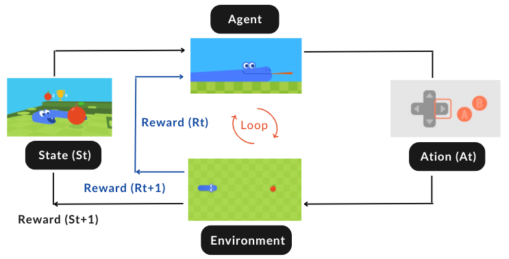

## What is Reinforcement Learning?
Reinforcement learning is for the agent to learn how to make better decisions by choosing actions that maximize rewards over time. This RL loop outputs a sequence of state, action, reward and next state:
